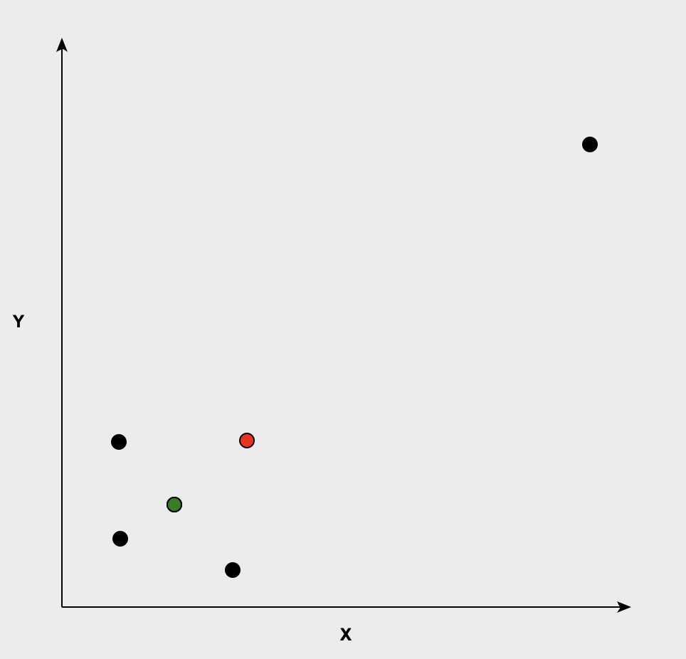
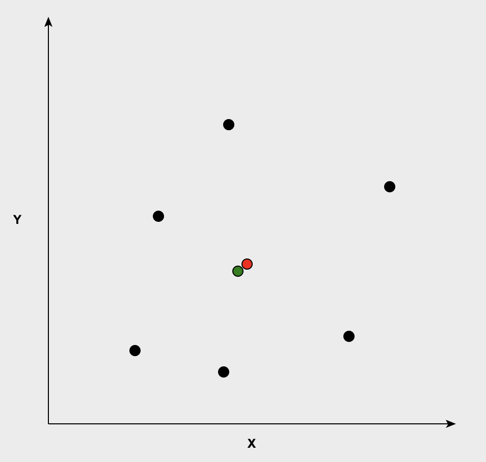
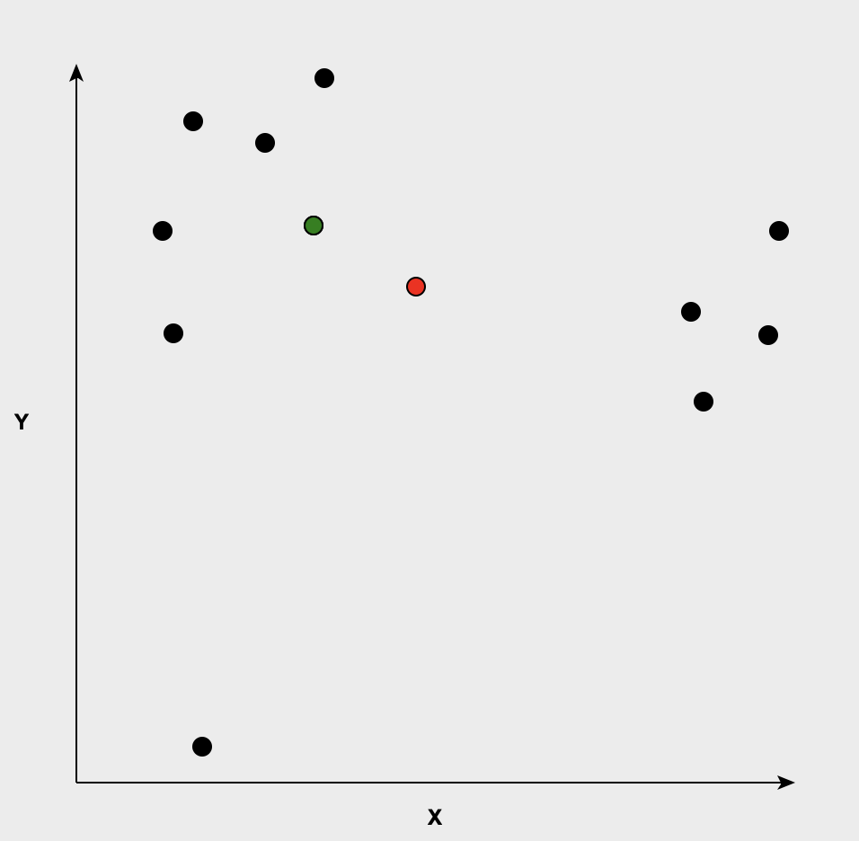

# Firefighter Stations

This project solves a problem for the firefighter department of your city.

The fire department might want to build a new fire station:

1) in a location where the total squared distance from the station to all houses in the town is minimized.
2) in a location where the total absolute distance from the station to all houses in the town is minimized.

This project allows you to mark the houses on a 2D plane. It will compute the two locations that minimize the two metrics.

1) To minimize the SSE (Sum of squared errors), we can just take the mean of the coordinates, both on the x and on the y axis.

2) To minimize the SAE (sum of absolute errors), we have to compute the geometric median of the coordinates (this is the statistical median, in case of 1D coordinates).
Unfortunately, the computation of the geometric median does not have a closed form solution.
We need to compute it with numerical methods.
Here we apply an iterative gradient descent optimization to obtain a close enough estimate of the geometric_median.

In the pictures, the black dots represent the houses, the red dot is the position to solve 1), while the green dot marks the position to solve 2).

